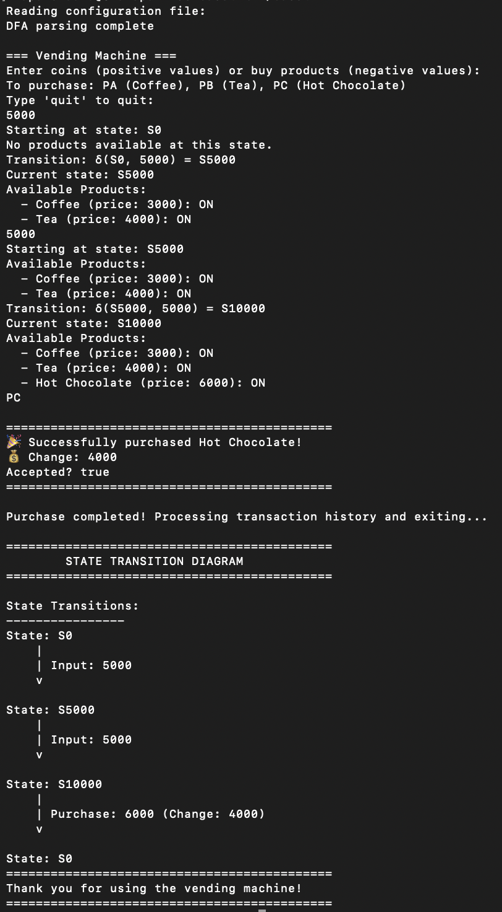
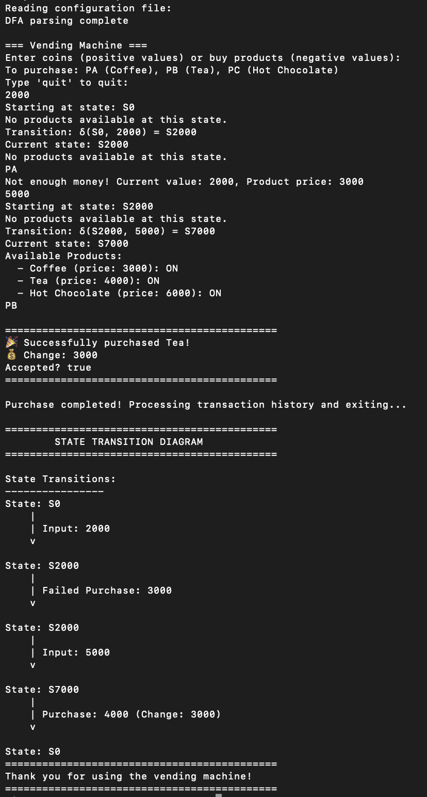
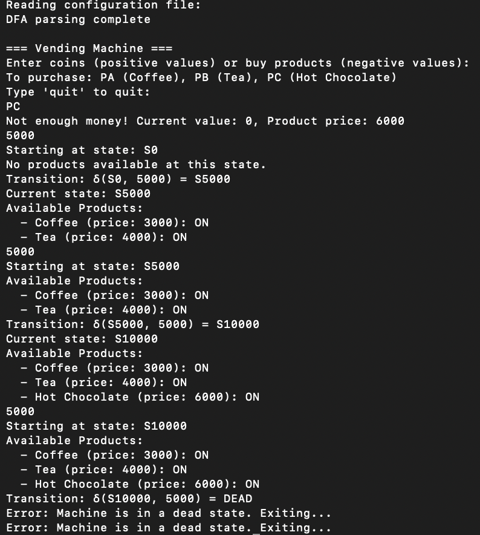

# DFA Vending Machine  

A **Deterministic Finite Automata (DFA) based Vending Machine** implemented in **Go**, using a configuration file to define the DFA states and transitions.

## 📜 Table of Contents  

- [📜 Table of Contents](#-table-of-contents)  
- [👥 Team Members](#-team-members)  
- [🛠 Installation](#-installation)  
- [🚀 Usage](#-usage)  
- [📷 Screenshots](#-screenshots)
- [📂 Project Structure](#-project-structure)  
- [🔍 How the Code Works](#-how-the-code-works)
- [📜 DFA Configuration File](#-dfa-configuration-file)  
- [📝 Code Documentation](#-code-documentation)  
- [📃 License](#-license)  

---

## 👥 Team Members  
- **[Daffa Indra Wibowo (23/518514/PA/22253)]**   
- **[M. Argya Vityasy (23/522547/PA/22475)]** 

---

## 🛠 Installation  

### Prerequisites  
Ensure you have the following installed:  
- **Go** (version 1.16 or higher)  

### Steps  
1. **Clone the repository**  
   ```sh
   git clone https://github.com/yourusername/DFA-vending-machine.git
   cd DFA-vending-machine
   ```
2. **Run the vending machine**  
   ```sh
   go run main.go
   ```

---

## 🚀 Usage  

1. Run the executable.  
2. Follow the on-screen instructions to insert money (e.g., 1000, 2000, 5000) using valid inputs from the DFA alphabet.
3. Purchase products using the product codes:
   - PA: Coffee (3000)
   - PB: Tea (4000)
   - PC: Hot Chocolate (6000)
4. The system will calculate change and return to the initial state after a successful purchase.
5. Type 'quit' to exit the program.

---

## 📷 Screenshots

### Vending Machine Demo (Input Output)
#### Success Right Away


#### Insufficient Money


#### Reached a Dead State


---

## 📂 Project Structure  

```
basot/
│── src/
│   ├── process.go         # Process user input and handle purchases
│   ├── parse.go           # Parse DFA configuration file
│   ├── products.go        # Manage product availability
│── config/
│   ├── machine_struct.go  # DFA and product data structures
│   ├── dfa_config.txt     # DFA state transitions configuration
│── main.go                # Main program logic
│── README.md              # Project documentation
```

---

## 🔍 How the Code Works

### 1. DFA Initialization
The program begins by parsing the DFA configuration file (`dfa_config.txt`) which defines states, alphabet, transitions, and accept states. The parsing logic in `parse.go` reads the configuration and builds the DFA structure:

```go
// Example from src/parse.go
func ParseDFAConfig(filePath string) (DFA *config.DFA, err error) {
    // ...existing code...
    
    dfa := &config.DFA{
        States:       make([]string, 0),
        Alphabet:     make([]string, 0),
        AcceptStates: make([]string, 0),
        Transitions:  make(map[string]map[string]string),
    }
    
    // Process configuration sections
    switch section {
    case "States":
        states := strings.Split(line, ",")
        for _, state := range states {
            trimmedState := strings.TrimSpace(state)
            dfa.States = append(dfa.States, trimmedState)
            dfa.Transitions[trimmedState] = make(map[string]string)
        }
    // ...existing code...
    }
    
    return dfa, nil
}
```

The DFA structure is defined in `machine_struct.go`:

```go
// From config/machine_struct.go
type DFA struct {
    States       []string
    Alphabet     []string
    AcceptStates []string
    StartState   string
    Transitions  map[string]map[string]string
}
```

### 2. User Input Processing
The main loop in `main.go` handles user input, including money insertion and product purchases:

```go
// Example from main.go
for !purchaseMade {
    // Read user input
    input, _ := reader.ReadString('\n')
    input = strings.TrimSpace(input)

    // Check for exit command
    if strings.ToLower(input) == "quit" {
        // ...existing code...
        break
    }

    // Check if this is a purchase command
    if strings.HasPrefix(input, "P") {
        // Extract the price from the input
        input = config.PriceMap[input]
        // ...existing code...
        newState, change := src.ProcessPurchase(input, currentState, vendingMachineProducts, dfa)
        // ...existing code...
    }

    // Handle regular input (money insertion)
    nextState := src.ProcessInput(dfa, currentState, input, vendingMachineProducts)
    // ...existing code...
}
```

Money inputs are validated against the DFA alphabet and cause state transitions:

```go
// Example from src/process.go
func ProcessInput(dfa *config.DFA, currentState string, input string, vendingMachineProducts []config.VendingMachineProduct) string {
    // ...existing code...
    
    // Check if the input string is in the alphabet
    if !IsInAlphabet(dfa, input) {
        fmt.Printf("Error: Input '%s' contains symbols not in the alphabet.\n", input)
        return currentState
    }

    // Check if there's a transition for this state and input
    if nextState, exists := dfa.Transitions[currentState][input]; exists {
        fmt.Printf("Transition: δ(%s, %s) = %s\n", currentState, input, nextState)
        currentState = nextState
        // ...existing code...
    }
    
    return currentState
}
```

### 3. State Management
The system tracks the current state, which represents the amount of money inserted. Product availability is determined based on the current state value:

```go
// Example from src/products.go
func GetAvailableProducts(state string, vendingMachineProducts []config.VendingMachineProduct) []config.VendingMachineProduct {
    var availableProducts []config.VendingMachineProduct

    // Extract the numeric part from the state name
    numericPart := ""
    for _, char := range state {
        if char >= '0' && char <= '9' {
            numericPart += string(char)
        }
    }

    // Convert to integer if possible
    stateValue := 0
    if numericPart != "" {
        fmt.Sscanf(numericPart, "%d", &stateValue)
    }

    // Check each product threshold
    for _, product := range vendingMachineProducts {
        productValue := 0
        fmt.Sscanf(product.StateKey, "%d", &productValue)

        // If current state value is >= the product price, the product is available
        if stateValue >= productValue {
            availableProducts = append(availableProducts, product)
        }
    }

    return availableProducts
}
```

### 4. Purchase Processing
When a purchase is attempted, the system checks if there's enough money, calculates change, and resets the state:

```go
// Example from src/process.go
func ProcessPurchase(input string, currentState string, vendingMachineProducts []config.VendingMachineProduct, dfa *config.DFA) (string, int) {
    // Extract the numeric part from the state name
    productPrice, _ := strconv.Atoi(input[1:])
    
    // Get current value from state
    numericPart := ""
    for _, char := range currentState {
        if char >= '0' && char <= '9' {
            numericPart += string(char)
        }
    }
    
    currentValue := 0
    if numericPart != "" {
        fmt.Sscanf(numericPart, "%d", &currentValue)
    }

    // Check if there's enough money
    if currentValue < productPrice {
        fmt.Printf("Not enough money! Current value: %d, Product price: %d\n",
            currentValue, productPrice)
        return currentState, 0
    }

    // Calculate change
    change := currentValue - productPrice
    
    // ...existing code...
    
    // Find the new state after purchase
    newStateValue := dfa.Transitions[currentState][input]
    
    // ...existing code...
    
    return newStateValue, change
}
```

Product codes are mapped to prices in the configuration:

```go
// From config/machine_struct.go
var PriceMap = map[string]string{
    "PA": "-3000",  // Coffee
    "PB": "-4000",  // Tea
    "PC": "-6000",  // Hot Chocolate
}
```

### 5. Visualization
After a transaction is completed or when the user quits, a state transition diagram is displayed:

```go
// Example from main.go
func displayStateTransitionDiagram(history []string) {
    fmt.Println("\n============================================")
    fmt.Println("        STATE TRANSITION DIAGRAM")
    fmt.Println("============================================")

    fmt.Println("\nState Transitions:")
    fmt.Println("----------------")

    // Display the full transition history with arrows
    for i := 0; i < len(history); i++ {
        if i%2 == 0 {
            // This is a state
            if i > 0 {
                fmt.Printf("\n")
            }
            fmt.Printf("State: %s", history[i])
        } else {
            // This is a transition label
            fmt.Printf("\n    |\n    | %s\n    v\n", history[i])
        }
    }
    
    // ...existing code...
}
```

The system outputs a visual representation of each transition:

```
State: S0
    |
    | Input: 1000
    v
State: S1000
    |
    | Input: 2000
    v
State: S3000
    |
    | Purchase: 3000 (Change: 0)
    v
State: S0
```

### 6. DFA-Based Validation
The system uses the DFA to validate all inputs and state transitions. This ensures that only valid coin denominations can be inserted and that purchases can only be made from accept states:

```go
// Example validation logic
func IsInAlphabet(dfa *config.DFA, input string) bool {
    for _, symbol := range dfa.Alphabet {
        if symbol == input {
            return true
        }
    }
    return false
}

// Check if a state is an accept state
isAccepted := false
for _, acceptState := range dfa.AcceptStates {
    if newStateValue == acceptState {
        isAccepted = true
        break
    }
}
```

This DFA-based approach ensures that the vending machine follows the specified state transition rules exactly, making the system robust and predictable.

---

## 📜 DFA Configuration File  

The DFA configuration file (`dfa_config.txt`) defines:  
- **States**: S0, S1000, S2000, S5000, etc.
- **Alphabet**: 1000, 2000, 5000, 10000
- **Start state**: S0
- **Accept states**: States with sufficient money for purchases
- **Transitions**: State transitions based on inputs

Example format:  
```
States:
S0, S1000, S2000, S5000, S10000

Alphabet:
1000, 2000, 5000, 10000

Start:
S0

Accept:
S3000, S4000, S5000, S6000, S7000, S8000, S9000, S10000

Transitions:
S0 1000 S1000
S0 2000 S2000
S0 5000 S5000
S0 10000 S10000
S1000 1000 S2000
...
```

---

## 📝 Code Documentation  

### `main.go`  
- Initializes the DFA and products
- Handles user input loop
- Tracks and displays transaction history

### `src/process.go`  
- Processes user inputs against the DFA
- Handles purchase commands
- Calculates change and state transitions

### `src/parse.go`  
- Parses the DFA configuration file
- Constructs the DFA structure with states and transitions

### `src/products.go`  
- Determines available products for a given state
- Displays product information to users

### `config/machine_struct.go`  
- Defines DFA and product data structures
- Maps product codes to prices

---

## 📃 License  

This project is licensed under the **MIT License**.  

---
